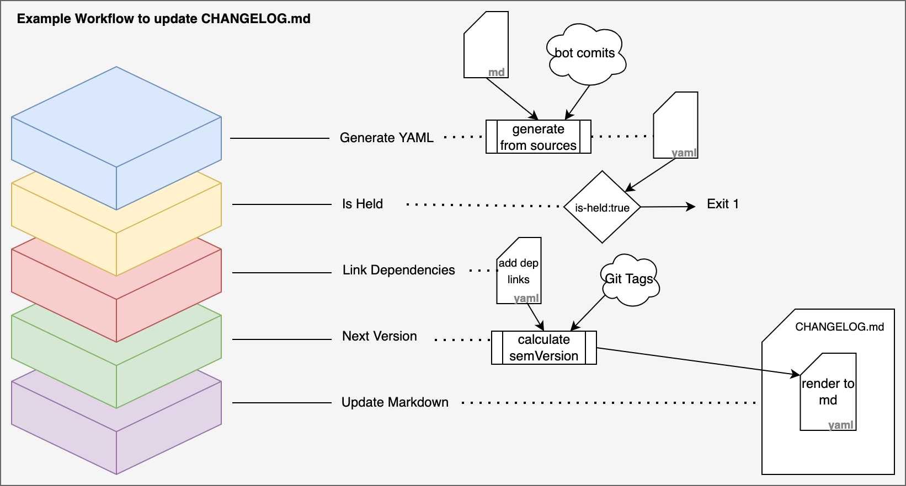

[](https://opensource.newrelic.com/oss-category/#new-relic-experimental)

# 🛠️ release-toolkit

The release toolkit is a series of small, composable tools that interact together to allow building heavily flexible release pipelines.

The toolkit provides a series of commands, also available as GitHub Actions, that can compose with your existing pipelines to fully automate releases with meaningful, user-facing changelogs.

The way in which the toolkit works is the following:

1. Maintainers add human-readable changelog entries to the `## Unreleased` section in a [`CHANGELOG.md`](https://keepachangelog.com/en/1.0.0/) file.
2. When the release process is initiated, a pipeline using the toolkit will:
   1. Put the contents of the `## Unreleased` section in a machine-readable yaml file, `changelog.yaml`
   2. Add dependency update entries from Renovate or Dependabot commits
   3. Automatically calculate the next version following semver standards
   4. Generate a Markdown document with the release notes for this release
   5. Reincorporate all the contents of `changelog.yaml` into `CHANGELOG.md`, under the correct version header.

Each of these steps is performed as a different step in the pipeline, giving maintainers complete flexibility to skip or add intermediate steps. The machine-readable `changelog.yaml` can be easily edited with simple scripts, allowing more flexibility to add, remove, or change changelog entries before the steps that act on them take place.

## Sneak peek

A pipeline using the release toolkit could look like the following:

```yaml
name: Release workflow
on:
   workflow-dispatch:
jobs:
  - uses: actions/checkout@v3
  - name: Generate transient changelog.yaml
    uses: newrelic/release-toolkit/generate-yaml@v1
    with:
       excluded-dirs: .github
    # changelog.yaml is a temporary, machine-readable file containing unreleased changes.
    # - Entries from your CHANGELOG.md's Unreleased section.
    # - Entries generated from bot commits (e.g. dependabot/renovate)
  # - name: You can hack changelog.yaml!
  #   run: |
  #     yq ...
  #     custom-script.sh ...
  - name: Figure out next version automatically
    id: next-version
    uses: newrelic/release-toolkit/next-version@v1
  - name: Generate release notes
    uses: newrelic/release-toolkit/render@v1
    # CHANGELOG.partial.md now contains release notes for this version.
  - name: Update CHANGELOG.md
    uses: newrelic/release-toolkit/update-markdown@v1
    with:
      next-version: ${{ steps.next-version.outputs.version }}
    # CHANGELOG.md is now updated with the contents of changelog.yaml, in MD format.
  - name: Commit and tag release
    run: |
      VERSION="${{ steps.next-version.outputs.next-version }}"
      git add CHANGELOG.md
      git commit -m "release $VERSION"
      git push
      gh release create $VERSION -F CHANGELOG.partial.md
  - name: Build and publish artifacts
    run: |
      docker build . -t example:${{ steps.next-version.outputs.next-version }}
      docker push example:${{ steps.next-version.outputs.next-version }}
```

## `generate-changelog` and `changelog.yaml`


The heart of the release toolkit architecture is the `changelog.yaml` file. This file is transient (i.e. it is not committed into the repository), and is typically generated by the `generate-yaml` action as a first step in a release pipeline. Subsequent steps will look at this file as the source of truth.

`generate-changelog` will populate `changelog.yaml` with:
- Changelog entries written by maintainers in the `## Unreleased` section of `CHANGELOG.md`. Typically, these entries will be added in the same PR the mentioned changes are.
- [Dependabot](https://github.com/dependabot) commits that happened after the last release.
- [Renovate](https://github.com/renovatebot/renovate) commits that happened after the last release.

The changelog object represented in this YAML file has 3 important fields:
- `changes`: List of changes parsed from `CHANGELOG.md` Changes have a type and a message, and changes belonging to the same type are grouped in the release notes.
- `dependencies`: List of dependencies that have been updated in this release. Entries optionally include from and to which version the dependency has been updates.
- `notes`: This is a free-text field that is included in the release notes before the list of changes. It can be used to add context to some changes, point users to documentations, or anything at all. Markdown syntax is allowed.

A freshly-generated `changelog.yaml` file looks like this:

```yaml
notes: |-
  ### Important announcement (note)
  This is a release note
changes:
  - type: breaking
    message: Support has been removed
  - type: security
    message: Fixed a security issue
  - type: enhancement
    message: New feature has been added
dependencies:
  - name: docker/setup-buildx-action
    from: "1.0.0"
    to: "2.0.0"
    meta:
      pr: "100"
      commit: a72b98709dfa0d28cf7c73020f3dede670f7a37f
```

In addition to the fields listed above, there's a fourth boolean field called `is-held`. Purpose and behavior of this field is explained in the advanced section of this manual.

This `generate-yaml` command will extract this changes and notes from 3 different sources:

## `render-markdown` and `update-markdown`


As a part of the release process, contents of the `## Unreleased` section in `CHANGELOG.md` need to be moved under a header with the name of the version being released. This is done by `render-markdown`, which loads a `changelog.yaml` file and pretty-prints it in Markdown format, grouping changes under headers depending on their type.

The list of entry types, and therefore groups, supported by the release-toolkit are:

- `breaking`: A breaking change on a user-facing API. Rendered first and with a warning sign to quickly catch the attention of the reader.
- `security`: Security fixes that remediate potential or existing security vulnerabilities.
- `enhancement`: New features or improvements to existing ones.
- `bugfix`: Fixes to incorrect behavior of the application.

Additionally, a section with changes to dependencies is also included after the list of changes.

The Markdown version of the `changelog.yaml` file mentioned above would be:

```markdown
## v1.2.3 - 2022-10-11

### Important announcement (note)

This is a release note

### ⚠️️ Breaking changes ⚠️
- Support has been removed

### 🛡️ Security notices
- Fixed a security issue

### 🚀 Enhancements
- New feature has been added

### ⛓️ Dependencies
- Upgraded docker/setup-buildx-action from 1.0.0 to 2.0.0 (#100)
```

Complementary to `render-markdown`, `update-markdown` will merge the markdown version of `changelog.yaml` into the `CHANGELOG.md` file, generating a new version header with the changes. In this process, it also will empty the contents of the `## Unreleased` section.

## `next-version`


An important part of being able to automatically release is relieving maintainers from manually figuring out what would need the next version number be. This not only allows for fully automation of the process while respecting [Semantic Versioning](https://semver.org/) standards, it also _ensures_ that said standards are preserved, avoiding [Sentimental Versioning](http://sentimentalversioning.org/).

The next version number is computed by fetching the last existing tag on the repository, and bumping the appropriate number according to the highest impact change type listed in `changelog.yaml`.

The mapping between change types and bump types is as follows:

```
breaking    => Major
security    => Minor
enhancement => Minor
bugfix      => Patch
```

Dependency bumps will propagate the bump made to the library: Bumping the major version of a dependency will bump the major version of the program. As this may be an undesired effect, it is possible to "cap" the largest bump that dependencies can cause.

## Additional features

### `link-dependencies`

`link-dependencies` can be used to attach a link to the changelog of the bumped dependency for each dependency in the dependencies array.

To compute this link there the release toolkit tries to map the link executing this two tasks executed in the following order:
- Map the link from a [Dictionary file](#dictionary-file).
- [Auto-detected GitHub repository changelog](#automatically-detected-GitHub-repository).

#### Dictionary file
A dictionary is a YAML file with a root dictionary object, which contains a map from dependency names to a template that will be rendered into a URL pointing to its changelog.
The template link must be in Go tpl format and typically will include the {{.To.Original}} variable that will be replaced by the last bumped version.

Example dictionary file:
```yaml
dictionary:
  a-dependency: "https://github.com/my-org/a-dependency/releases/tag/{{.To.Original}}"
```

`changelog.yaml` before linking dependencies:
```yaml
dependencies:
  - name: a-dependency
    from: "2.1.0"
    to: "3.0.0"
```

`changelog.yaml` after linking dependencies:
```yaml
dependencies:
  - name: a-dependency
    from: "2.1.0"
    to: "3.0.0"
    meta:
      changelog: https://github.com/my-org/a-dependency/releases/tag/3.0.0
```

#### Automatically detected GitHub repository

When the dependency does not match any entry in the dictionary file but it does match GitHub repositories (`github.com/<org>/<repo>`),
the changelog link is automatically rendered using `https://github.com/<org>/<repo>/releases/tag/<new-version>`.

After rendering, the release toolkit checks if the changelog link is valid by performing a HTTP request, so only valid
changelog links are used. As some repositories include a leading `v` in the tag name identifying the release and some
others don't, both possible links are checked.

### Automated releasing

The ultimate goal of the release toolkit is to allow for fully automated release pipelines that produce meaningful changelogs and respect semver standards. For this reason, the recommended way of implementing the toolkit is as a scheduled job that runs on the `main`/`master` branch of your source tree, for example every tuesday at midnight.

The release toolkit allows you to build a pipeline that creates a release with its changelog and version automatically if there are any unreleased changes in your main branch.

However, it is possible that, in some cases, you may want to hold changes from being released as you want to "pack" them with future changes for UX reasons. To this end, the release toolkit includes the concept of holding releases. A release can be held by including a `## Held` L2 header in `CHANGELOG.md`. This header must be followed by a paragraph explaining why automated releases are on hold:

```markdown
# Changelog
This is based on blah blah blah

## Held

Holding release as it contains massive breaking changes

## Unreleased

### Breaking
- Support has been removed

## v1.2.3 - 20YY-DD-MM
```

The presence of this header does not modify the fundamental behavior of any command. It does, however, cause `generate-changelog` to include a `held: true` property in `changelog.yaml`:

```yaml
held: true
changes:
  - type: breaking
    message: Support has been removed
```

This flag can be readily checked using the `is-held` action/command. `is-held` will echo the value of this property to `stdout`, and can be configured to exit with non-zero if `held` is set to `true`. While running as an action, it will also set the `is-held` step output to the value of the property. This allows your pipeline to react to this property and skip the release process if a `## Held` entry is present in your `CHANGELOG.md`.

`update-changelog` will not behave any different in presence of a `## Held` header, and will remove it before integrating the changelog for the latest release.

### Full example of automated releasing pipeline



```yaml
// TODO
```


## Actions

- [Generate YAML changelog](./generate-yaml/README.md)
- [Is Held](./is-held/README.md)
- [Link dependencies](./link-dependencies/README.md)
- [Next Version](./next-version/README.md)
- [render](./render/README.md)
- [Update markdown](./update-markdown/README.md)
- [Validate markdown](./validate-markdown/README.md)

## Contributing

Standard policy and procedure across the New Relic GitHub organization.

#### Useful Links
* [Code of Conduct](./CODE_OF_CONDUCT.md)
* [Security Policy](./SECURITY.md)
* [License](./LICENSE)
 
## Support

New Relic has open-sourced this project. This project is provided AS-IS WITHOUT WARRANTY OR DEDICATED SUPPORT. Issues and contributions should be reported to the project here on GitHub.

We encourage you to bring your experiences and questions to the [Explorers Hub](https://discuss.newrelic.com) where our community members collaborate on solutions and new ideas.

## License

release-toolkit is licensed under the [Apache 2.0](http://apache.org/licenses/LICENSE-2.0.txt) License.

## Disclaimer

This tool is provided by New Relic AS IS, without warranty of any kind. New Relic does not guarantee that the tool will: not cause any disruption to services or systems; provide results that are complete or 100% accurate; correct or cure any detected vulnerability; or provide specific remediation advice.
